


 



 


 

 

 


<a href="https://github.com/Suke2004/atlas-go">
  
</a>

| | SIDE QUEST | OBJECTIVE | LOOT |
|:---:|---|---|---|
| `ACTIVE` | [SUPERTUNNEL](https://github.com/SuperPlugs/SuperTunnel) | Ship a browser-based VPN controller with the SuperPlugs guild | TypeScript |
| `ACTIVE` | [SUPERDRIBBLE](https://github.com/SuperPlugs/SuperDribble) | Craft an audio amplifier extension for web browsers | TypeScript |
| `CLEAR!` | [LOAD-BALANCER](https://github.com/Suke2004/load-balancer) | Build a smart adaptive load balancer with live dashboard | Go, JS |
| `CLEAR!` | [GLOBAL-SSH-SERVER](https://github.com/Suke2004/Global-SSH-Server) | Turn an Android phone into a global SSH server | Termux, Cloudflare |
| `CLEAR!` | [IMAGE-DEHAZER](https://github.com/Suke2004/image-dehazer) | Dehaze photos AND video in real time | Python, OpenCV |
| `CLEAR!` | [SELF-DRIVING-VEHICLE](https://github.com/Suke2004/self-driving-vehicle) | Prototype an autonomous vehicle brain | C++ |

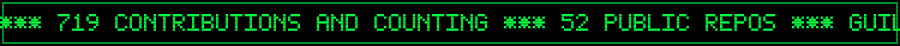

 

  
  

  

  

 


  <picture>
    <source media="(prefers-color-scheme: dark)" srcset="https://raw.githubusercontent.com/Suke2004/Suke2004/pacman-output/pacman-contribution-graph-dark.svg?game=pacman">
    <source media="(prefers-color-scheme: light)" srcset="https://raw.githubusercontent.com/Suke2004/Suke2004/pacman-output/pacman-contribution-graph.svg?game=pacman">
    
  </picture>

 


 
  

 

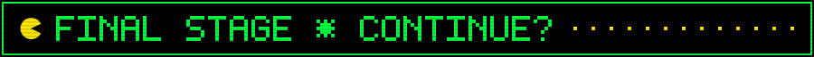

  

 

